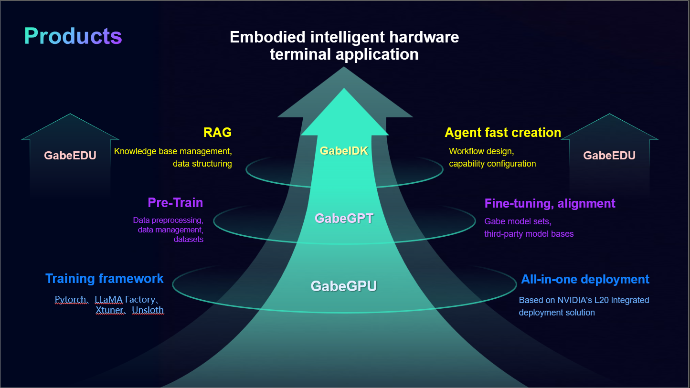

# Sotaos-Gabe

# Introduction

Sotaos-Gabe stands for State Of The Art Open Source GenAI for Business Engine. Our vision is to enable generative AI and robots serve multiple industries.

We train industrial LLMs based on open source LLMs, such as DeepSeek, Qwen, etc. with industrial specific corpus to address industrial specific needs. On top of our industrial LLMs or public LLMs, we develop AI Agents to enhance productivity, streamline operations, and enable intelligent decision-making. 

## Importance of Industrial LLM

The emergence of Large Language Models (LLMs) has revolutionized the way industries approach automation, decision-making, and knowledge management. These models, trained on vast datasets, possess the ability to understand and generate human-like text across various domains. In industrial contexts, LLMs are being leveraged for tasks such as predictive maintenance, process optimization, supply chain management, and customer support.

## Definition and Scope of Industrial LLM

Large Language Models (LLMs) tailored for industrial applications represent a specialized subset of AI systems designed to address domain-specific challenges. Unlike general-purpose LLMs, industrial LLMs are fine-tuned on industry-relevant datasets, enabling them to perform tasks such as technical documentation generation, predictive maintenance analysis, and process optimization.

### Characteristics of Industrial LLMs

- **Domain-Specific Training**: Industrial LLMs are trained on datasets from sectors like manufacturing, healthcare, finance, and energy, ensuring outputs align with industry standards.
- **Customization**: These models can be customized further to suit unique organizational workflows or proprietary data formats.
- **Scalability**: Industrial LLMs are built to handle large-scale operations, processing terabytes of structured and unstructured data efficiently.

## AI Agent Ecosystem

AI agents are autonomous systems capable of perceiving their environment, making decisions, and taking actions to achieve predefined goals. In the industrial context, these agents leverage LLMs and other AI technologies to enhance productivity, streamline operations, and enable intelligent decision-making.

### Components of the AI Agent Ecosystem

- **Sensing Layer**: Collects real-time data from IoT devices, sensors, and enterprise systems.
- **Processing Layer**: Employs AI models, including LLMs, to analyze data and derive actionable insights.
- **Action Layer**: Executes decisions, often interfacing with robotic systems, software platforms, or human operators.

### Collaboration Between LLMs and AI Agents

Industrial LLMs often serve as the "brain" behind AI agents, providing contextual understanding and decision support. For instance:

- An AI agent monitoring a power grid might use an LLM to interpret maintenance reports and recommend preemptive repairs.
- In logistics, an AI agent could employ an LLM to optimize delivery routes based on weather forecasts and traffic patterns.

# Product Overview

Below is our product GABE overview.

# Solution Overview

Below is our solution overview.

